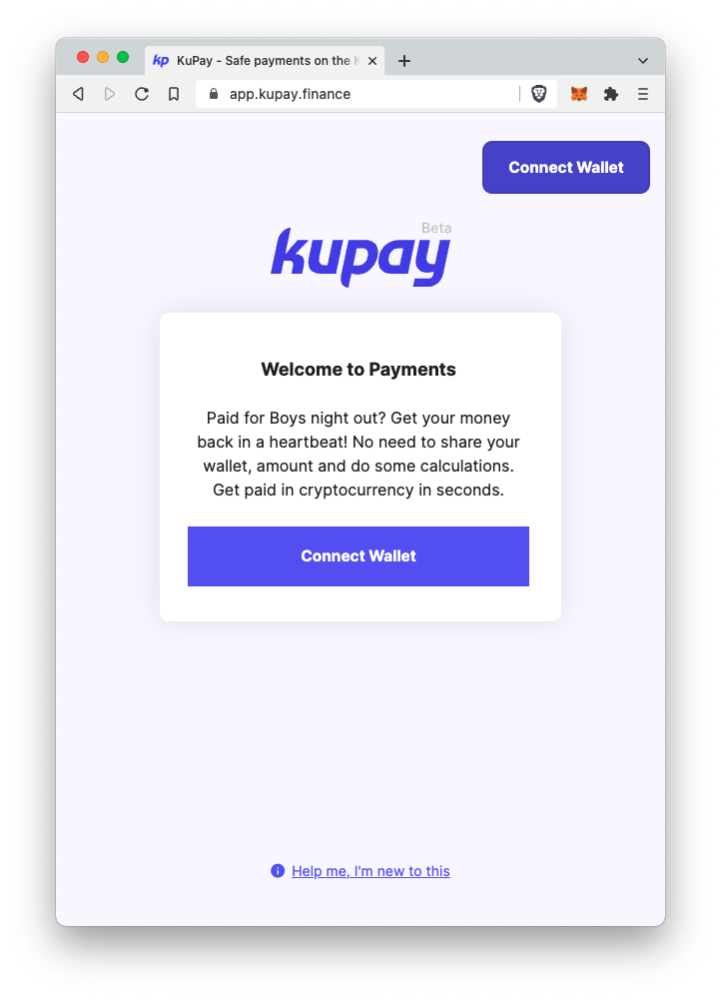
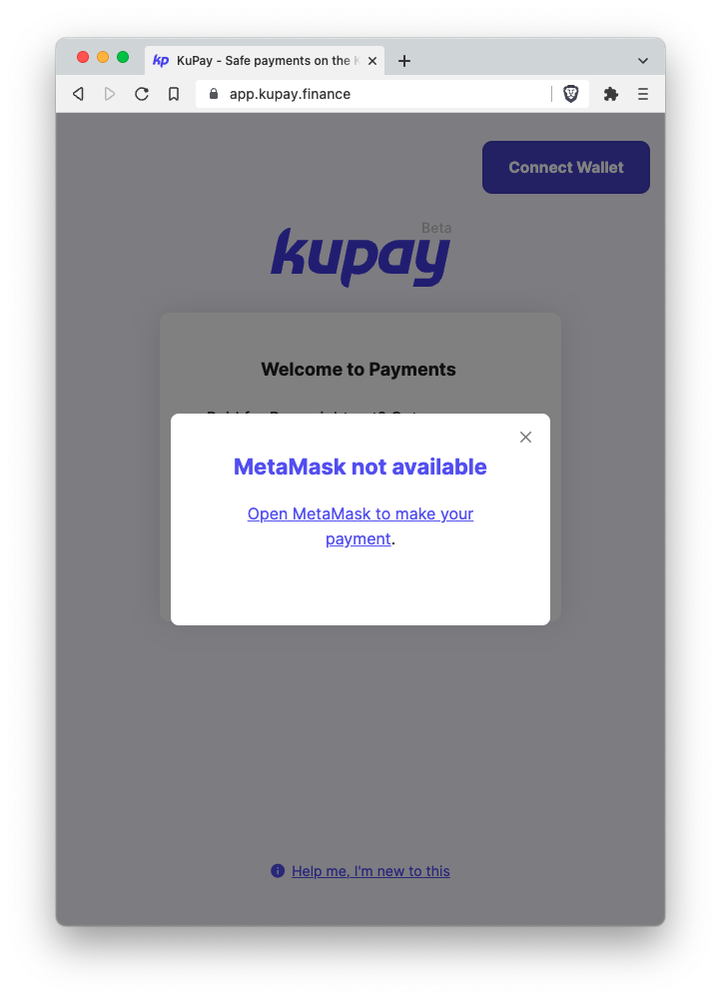
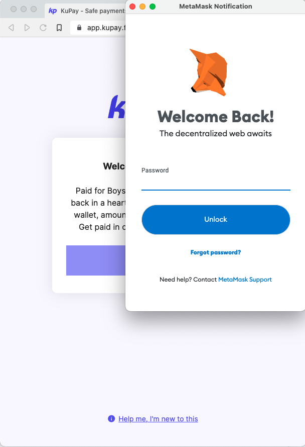
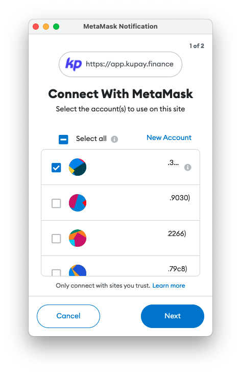
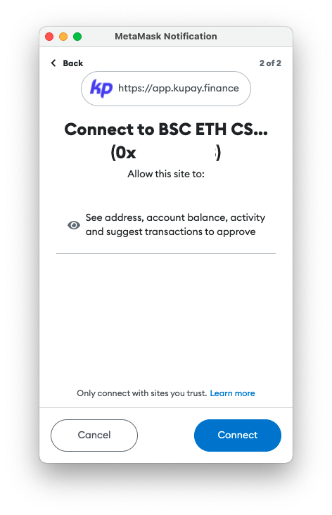
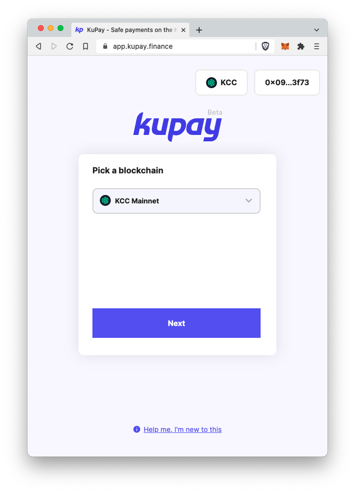
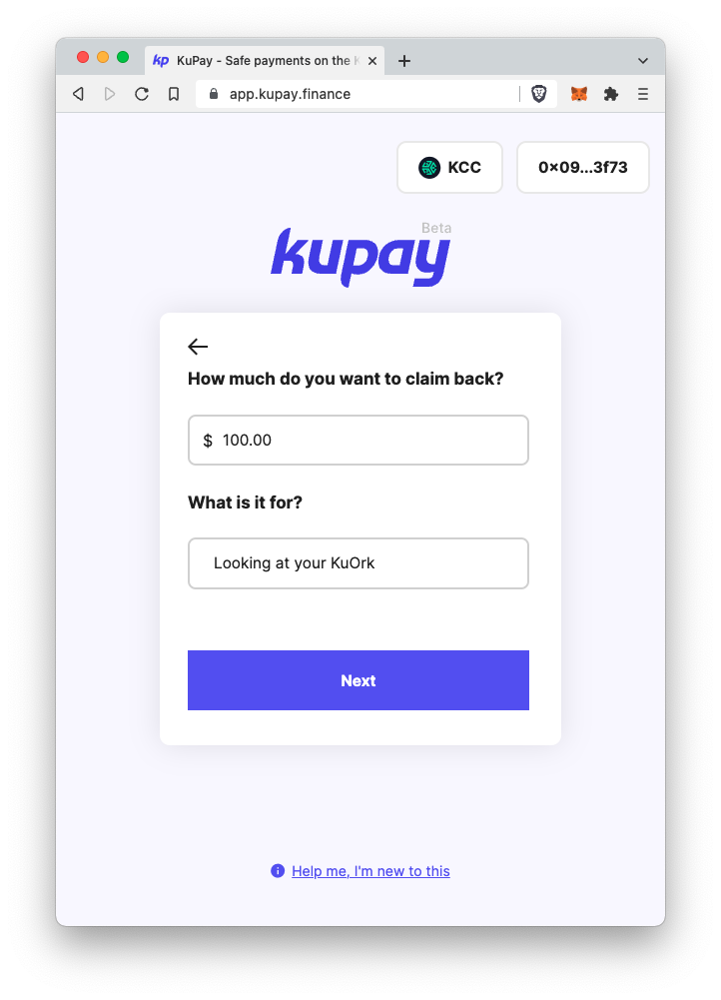
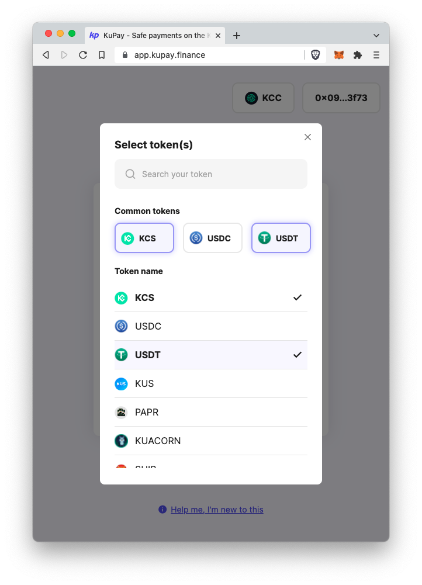
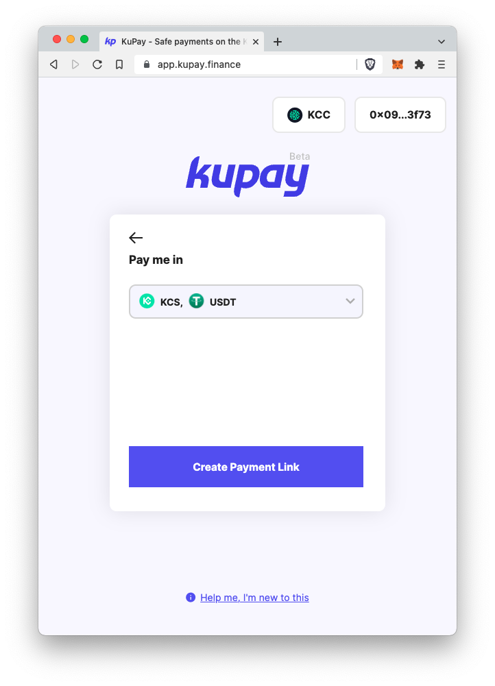
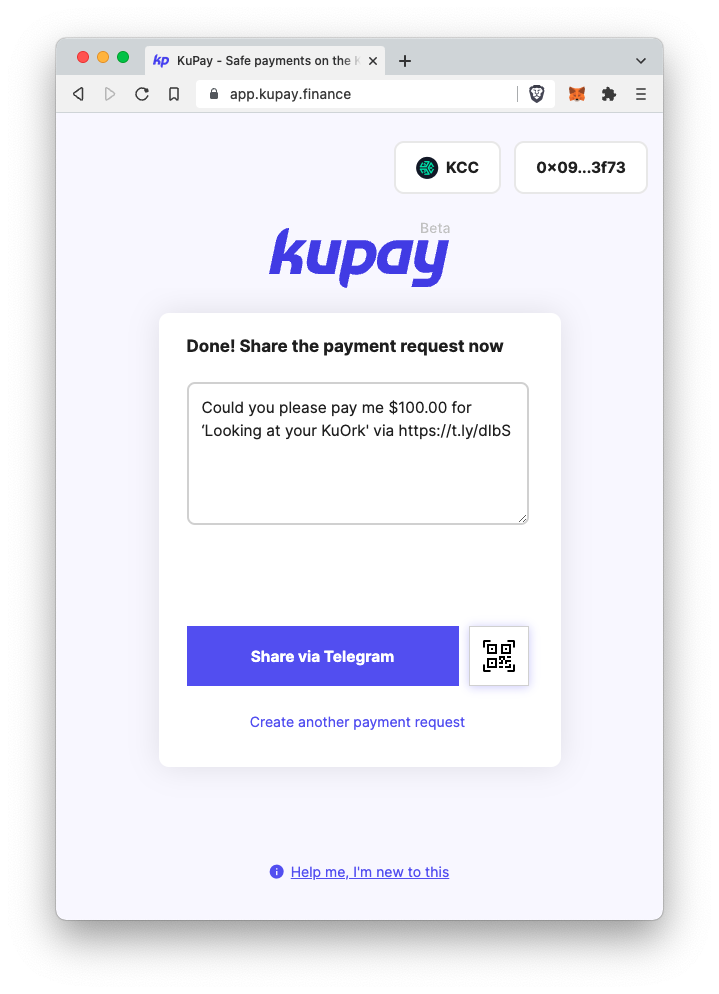

# Create a Payment Request

### Step 1

Visit [https://app.kupay.finance](https://app.kupay.finance) and connect to MetaMask. See [MetaMask instructions](metamask.md).

  

### Step 2

When you click **Connect Wallet**, a pop-up shows up to select the MetaMask account you wish to use. Click **Connect** to confirm.

 

### Step 3

Select the block chain where you would like to receive your money. Enter the amount, description and token(s) via the user friendly interface.

  

### Step 4

If it looks good, confirm and share your payment request with your friend. You can also click the QR to let your friend scan the QR code right away.

 

Does your friend need instructions on how to pay your request? You can find that here:


[making-payments-or-donations.md](making-payments-or-donations.md)


For a more in-depth guide, please check out our learning platform:


