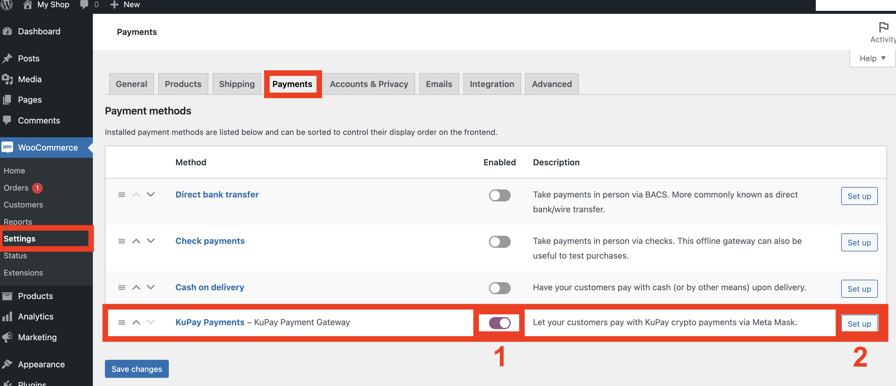
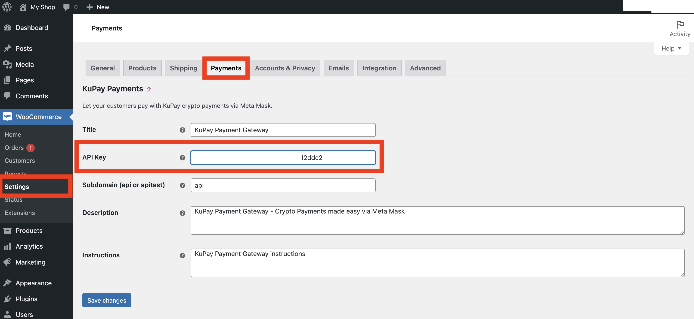

# Setup WooCommerce


**Good to know:** we currently support Shopify and WooCommerce. We have other platforms and a REST API and SDK on our roadmap to make it easier to integrate KuPay into your webshop or application. Contact us if you have a special request.


#### Requirements/ limitations:

1. Requires a KuPay merchant account. Apply now at [https://kupay.finance/checkout](https://kupay.finance/checkout)
2. Currently works with KuCoin Community Chain (**KCC**) and Binance Smart Chain (**BSC**) for our Checkout product, and many more chains for donations and payments.
3. Only works with **USD** currency at the moment. Please contact us to request another currency.
4. Only in **English** language
5. Tested on WordPress 5.9.3 and WooCommerce 6.3.0 and above
6. Requires PHP 7.0 or above

## Step-by-step

1. Sign up for a new Merchant account on [https://kupay.finance/checkout](https://kupay.finance/checkout)
2. When you have access to the merchant panel, you will find your API key on the **Integrations** page
3. Install the plugin on your WooCommerce website
4. Enable the payment method
5. Enter your API key
6. Place a test order to check that everything goes well


### 3. Install the plugin

Install via WordPress > Admin panel > Plugins > Add New > Search for "**kupay gateway**"


### 4. Enable the payment method

Go to WooCommerce > Settings > Payments and click the switch (1) to enable the KuPay payment method. You should now be on the following page:

```
/wp-admin/admin.php?page=wc-settings&tab=checkout
```

Now click **Set up** (2) for the KuPay Payment Gateway. If you have already set it up before, this button will instead say **Manage**.



### 5. Enter API Key

Go to WooCommerce > Settings > Payments and click **Set up** (or **Manage** if you did this before). You should now be on the following page:

```
/wp-admin/admin.php?page=wc-settings&tab=checkout&section=kupay
```

Now you can enter the API Key that you found in your KuPay Merchant panel.



## Upgrading

Keep an eye on your WordPress website. If there's a new update, you can upgrade with a simple click.

As always, follow the best practices for upgrading, including making backups of files and database, before any upgrades.

Afterwards, ensure that everything works well, by placing a test order and making the payment.
